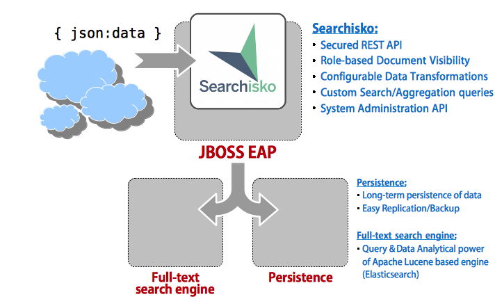

# Searchisko  

**Searchisko** is an open source project that allows to quickly build secured role-based REST service
to index, search, retrieve and aggregate content from heterogeneous sources. It can attribute content
to people and projects regardless of where the content originated.

Searchisko is Java EE 6 application which runs in the JBoss EAP 6 application server to provide REST API, and using 
Apache Lucene based full-text search engine and relational database in the background to provide powerful
content retrieval, full-text search and aggregation functions.

## Why have we created it?

Initially Searchisko was intended to provide a unified search experience across the multiple applications hosted at jboss.org but over time we realised it could also provide a powerful way to understand how people contribute to upstream projects using these applications and others on the internet.

## Documentation

Anyone who would like to use Searchisko or implement a REST client for Searchisko can learn more in the following documentation:

  - [Searchisko documentation](documentation/README.md).
  - See [Searchisko basic principles document](documentation/basic_principles_and_architecture.md) for Searchisko overview and motivation behind it.
  - Searchisko **REST API** for data manipulation and search/retrieval, see [`documentation`](documentation/README.md).

## Other resources

  - [Release Notes](RELEASE_NOTES.md)
  - GitHub [Issues](https://github.com/searchisko/searchisko/issues)
  - Developer mailing list [searchisko-dev](https://lists.jboss.org/mailman/listinfo/searchisko-dev) ([archive](http://lists.jboss.org/pipermail/searchisko-dev/))

## License

    Copyright 2012 Red Hat Inc. and/or its affiliates and other contributors
    as indicated by the @authors tag.

    Licensed under the Apache License, Version 2.0 (the "License");
    you may not use this file except in compliance with the License.
    You may obtain a copy of the License at

        http://www.apache.org/licenses/LICENSE-2.0

    Unless required by applicable law or agreed to in writing, software
    distributed under the License is distributed on an "AS IS" BASIS,
    WITHOUT WARRANTIES OR CONDITIONS OF ANY KIND, either express or implied.
    See the License for the specific language governing permissions and
    limitations under the License.
