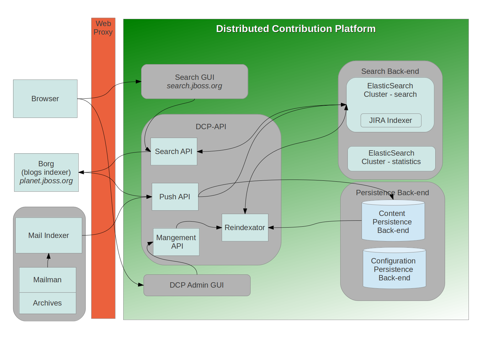

Searchisko Basic Principles and Architecture
============================================

The **Searchisko** is a system designed to store,
search and retrieve content related to Open Source Software (OSS) projects
which may be distributed across multiple heterogenous systems.

The aim is to provide greater insight into where projects may benefit from
sharing a common approach to problems as well as highlighting the contributions
being made and who is contributing them.

The need for the Searchisko came from the realization that individual projects
often want the ability to choose their own services such as source code repositories,
wikis, forums, mailing lists and issue trackers rather than relying on a
centralized infrastructure. Where projects are created by the same organization,
or share contributors, there is an equal argument for the economies of scale
provided by a centralized service so another reason for the Searchisko is to allow
the gradual migration of projects from one service to another without impacting
the ability to consistently search or retrieve information about them.

The main design attributes of the Searchisko are:

* openness and ease of use
* simple, quick and flexible search of stored information
* highly flexible stored information structures
* possibility to store information with guaranteed long-term persistence for 
  data sources where it is hard or impossible to obtain the information again in 
  the future (eg. blog posts obtained using the RSS protocol)
* high availability of services (both for the common runtime and at platform upgrade time)

To allow for simple searches across multiple projects the content stored in the Searchisko will
be normalized as follows:

* content type (e.g. blog post, issue, source code commit, mailing list email)
* project
* contributor
* tags (either associated with the original content or added after it's been stored in the Searchisko)
* activity date - (e.g. created, updated dates)  

The Searchisko provides a **REST API** using JSON for content manipulation and search/retrieval of content.
Feeds in [Atom Syndication Format](http://tools.ietf.org/html/rfc4287) are also available. This
allows for simple integration with other systems and modern AJAX/HTML 5 based frontends/websites.
See [`Searchisko REST API documentation`](rest-api/README.md) for details. 

Possible use cases for "project pages" maintained by project teams:

* Unified fulltext search across project content.
* Fulltext search for one content type - eg. project blog [http://arquillian.org/blog](http://arquillian.org/blog).
* Project-specific planet blog aggregator for project related blogposts coming from multiple blogging services.
* Contributor list - info about project team members, contributors, details about who contributed what.
* Project tag cloud - hot topics around the project during the last week, month, quarter, year.
* Project activity graphs - overall or per content type (commits, blogposts), timeline histograms etc.
* Project specific artifacts "repository" application - eg. something like [modules.ceylon-lang.org](http://modules.ceylon-lang.org)
  site or [JDF quickstarts page](http://www.jboss.org/jdf/quickstarts/get-started/). 
  The Searchisko can be used just for the search part or also for presenting categorized content on pages.

Possible use cases for "community pages":

* Unified fulltext search across all community content
* List of all community projects - like [www.jboss.org/projects](http://www.jboss.org/projects)
* Planet - whole community blog aggregator like [planet.jboss.org](http://planet.jboss.org)
* Who's Who in the community - info about community contributors, which 
  projects they contribute to, all activities over all projects, etc...
* Community tag cloud - hot topics in the community during the last week, month, quarter, year

## Basic Principles

### Flexible data structure for content
A document added to the Searchisko will be stored in the same (JSON) format as it's
received with all fields provided.
Some 'system data fields' with unique nonconflicting names will be added 
into this document before it is stored in the Searchisko,
see [details here](rest-api/content/dcp_content_object.md).

We can define other "system data fields" specific for the concrete content types. 
For example content type "issue" can store issues from JIRA, GitHub, Bugzilla, 
but we define new system fields for them with normalized values, such as 
"issue type" (bug, feature request), "issue status" (new, in progress, resolved, closed) etc.

Documents without "system data fields" can be stored in the Searchisko, but will not 
be visible/searchable over the basic search GUI. They will be available over a custom search 
API by users who need them.
 
### Flexible normalization process
Normalization of the values for `sys_contributors` and `sys_project` field must be
flexible enough to handle distinct identifiers sent from distinct systems to the normalized unique ones.

Normalization process for contributors:

* a contributor is uniquely identified by a string `Name Surname <primaryemail@email.com>` 
  containing primary email address. Secondary email addresses used by given contributor 
  and other user identifiers from other systems (eg. jboss.org username, GitHub username) 
  are joined to this primary string in contributor mapping definition.
* contributor mapping definitions are stored in the Searchisko, see [Contributors mapping documentation]
  (rest-api/management/contributor.md)
* an external content provider passes the contributor identifier in an arbitrary document 
  field. The Searchisko Push API looks for the contributor identifier in the mapping and stores it
  into the `sys_contributors` field before storing the document in the Searchisko.
* when the mapping definition for some contributor changes, all affected 
  documents in the Searchisko search indices must be reindexed. Because documents stored 
  in the Searchisko contain all the original input fields no external data sources need to be 
  involved. We simply obtain documents from our search indices and update them here.  
  The Searchisko contains a universal component called the "Reindexator" which is able to perform this process.

The same principle is used for project identifier normalization, see 
[Project configuration documentation](rest-api/management/project.md)

### Long-term content persistence support
Guaranteed long-term persistence of content is necessary for some data sources
where it's hard or impossible to obtain the content again in the future. One example 
is blog posts obtained using the RSS protocol. The Searchisko supports this via the "Persistence back-end"
component. The "Reindexator" component is able to rebuild search indices from data stored here.
 
### Zero downtime upgrade process
We need to develop a zero downtime upgrade process in case of any significant changes in
the Searchisko behaviour or in any of the underlying technologies:

1. if the platform REST API changes and becomes backward incompatible for the 
   new version, then prepare a testing instance with the new API and announce the 
   upgrade to the community, so they can prepare for the migration
2. prepare/install the "new" platform instance
3. disable the information input into the "old" platform instance (disable Push API, 
   stop Indexers), data retrieval/search will still be possible
4. copy configurations and search indexes from the 'old' to the  'new' instance 
   - it can take a long time, depends on data amount
5. switch all "client" systems to the Searchisko over to the "new" platform instance
6. stop the old instance
7. enable the information input into "new" platform instance (enable Push API, start Indexers)

### Runtime environment
The Searchisko platform has a runtime agnostic architecture so distinct components can be
run on any platform and/or cloud provider (OpenShift, EC2 etc).

## Searchisko Architecture

### Push API

This component allows content to be pushed into the platform from various 
information sources. It supports the following basic CRUD and List operations:

* POST document into platform (create or update it based on provided 'provider content type' and id)
* DELETE document from platform (based on provided 'provider content type' and id)
* GET document from platform (based on provided 'provider content type' and id)
* LIST id's all documents of defined 'provider content type' currently available in platform

REST technology is used for this API.

Main API parameters used for document POST request:

* content provider identifier
* password
* provider content type - each content provider has set of 'provider content 
  types' configured. This configuration defines how the document is handled 
  during insertion into the platform.
* provider content identifier - unique identifier of content per given 'provider content type'
* provider content document - JSON formatted document to be inserted into platform

Main actions performed during document POST request handling:

* authentication - only an authorized request can insert data - the 
  authorization is performed over "content provider identifier" and "password"
* content processing necessary to produce defined 'sys_type' document - based on
  configuration for given 'provider content type' - adds 'system data fields' with 
  the values transformed using the 'data normalization' process etc.
* storage routing - based on the 'provider content type' configuration - stores 
  the data to a Search Back-end and a Persistence Back-end. It defines which 
  search index will be used in the Search Back-end etc.

Before a third-party starts to use the Searchisko it must negotiate a new 'content provider' 
access agreement with Searchisko administrators. Both parties must agree on the set of 'provider content 
type's for this access and define the configuration for each of them. 
See [Content provider documentation](rest-api/management/content_provider.md).

The framework for mappings/normalizations has been developed as part 
of the ElasticSearch JIRA river project and extracted to a separate GitHub 
project called [structured-content-tools](https://github.com/jbossorg/structured-content-tools).

### Search API

This component allows a user to retrieve/search content from the platform. It is 
used by both the JBoss Community Team developed websites (http://search.jboss.org
and http://planet.jboss.org) and third-party/project team developed websites.

The current search API supports a predefined set of filters and aggregations. The full ElasticSearch search 
API should be provided in the future but we need to first investigate whether or not this could
introduce security concerns, eg. harvesting of email addresses, denial of service attacks, etc...

We also need to implement some form of Quality of Service (QoS) handing here - for search requests
from unauthorized/unknown systems so they do not degrade the performance of the authorized/known systems.

Part of this API will be the "Project list" operation that allows you to obtain the list of project
identifiers and related project names used in platform normalized field `sys_project`.
 
### Search Back-end

Fulltext search nodes with distributed search indices etc.

Based on ElasticSearch technology - [http://www.elasticsearch.org](http://www.elasticsearch.org).

Information is not persistently stored here, because search indices must be 
rebuilt from scratch from data sources in some cases (typically when something significant 
is changed in ElasticSearch or Lucene).

Separate ElasticSearch cluster is used to store some statistics from the Searchisko runtime for use by Searchisko administrators.

### Persistence Back-end

This component realizes long-term persistence for selected content from data 
sources where it's hard or impossible to obtain the information again in the future 
(eg. blog posts obtained using the RSS protocol).

It's used by the Reindexator component to rebuild the search indices on the Search Back-end from scratch.

Some form of distributed key/value store (where value is JSON document) or SQL 
database should be used here.

Part of Persistence Back-end is used to store the Searchisko configuration data also.
 
### Indexers

These components run code provided and maintained by Searchisko Administrators that 
acquire content from external data sources and store it into the platform.

They can be implemented as ElasticSearch rivers, or as standalone processes using the "Searchisko Push API".
For example instances of [JIRA River Plugin for ElasticSearch](https://github.com/jbossorg/elasticsearch-river-jira) 
pulling data from distinct JIRA instances (http://issues.jboss.org, http://hibernate.onjira.com, etc...) 

This is an alternative to pushing content from third-party systems using the "Push API".
 
### Reindexator

This component performs search index updates in two main cases:

 * reindex data in Search back-end affected by changes in normalization mappings
   (for example new email address is added to some contributor mapping definition)
 * reindex data from Persistence back-end into Search back-end indices
 
### Management API

REST API for Searchisko management operations. Used by Searchisko Administrators directly or over Administrative GUI.
 
### Administrative GUI

Web GUI application used by Searchisko Administrators to configure and monitor the whole platform. Main use cases:

* platform runtime parameters monitoring, eg. [bigdesk for ElasticSearch](http://bigdesk.org) 
  and visualization of data stored in statistics part of Search back-end 
* platform configuration, eg. 'Push API' configuration (eg. providers), "Indexers" configuration etc.
* change of mappings for values normalization, start search index update for data affected by changed mapping
* start reindexing of data from the Persistence back-end into the Search back-end
* data migration to new version of platform during upgrade
